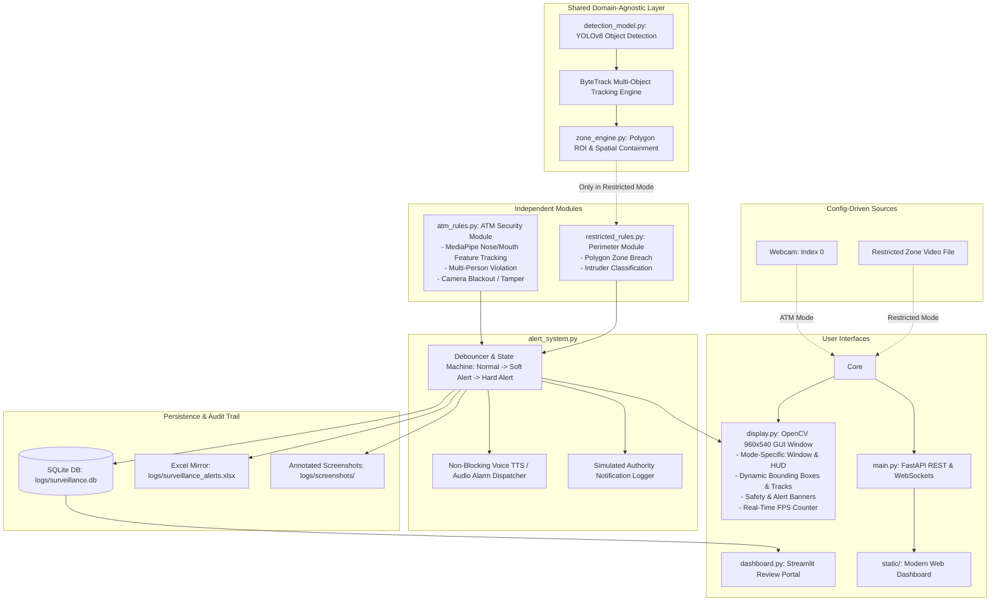

# Smart Video Surveillance & Real-Time Analytics System

A production-grade, modular real-time video surveillance and automated security analytics platform developed for an Applied Deep Learning capstone project. 

The system provides a **domain-agnostic core engine** (powered by **YOLOv8** person detection and **ByteTrack** multi-object tracking) integrated with **isolated, separately launchable operational modes**:
1. **ATM Security Mode (`atm`)**: Monitors live laptop webcam for Face Obscuration / Masking (MediaPipe 30-frame rolling-window hysteresis), Multi-Person violation, and Camera Blackout / Tampering. Runs at real-time speeds with person-only detection.
2. **Restricted Zone Intrusion Mode (`restricted`)**: Monitors designated polygon security zones on a CCTV surveillance feed for unauthorized perimeter breaches (blue box for outside, red box + alert + audio alarm for inside).

---

## 🏗️ System Architecture



---

## 🌟 Key Features

### 1. High-Performance Domain-Agnostic Core
- **YOLOv8 Object Detection**: High-speed inference targeted strictly to person detection (`class 0`).
- **ByteTrack Multi-Object Tracking**: Retains persistent IDs across brief occlusions with ultra-low compute latency.
- **Polygon ROI / Zone Engine**: Arbitrary polygon regions with fast point-in-polygon containment tests.
- **Hardware Acceleration**: Automatically selects CUDA (NVIDIA GPU), MPS (Apple Silicon), or CPU.

### 2. Isolated ATM Security Mode (`atm_rules.py`)
- **Live Webcam Only**: Always operates on the live camera stream (`index 0`).
- **Facial Landmark & Mask Detection**: Analyzes head region using lightweight MediaPipe FaceLandmarker targeting nose & mouth landmarks (8-10 points). Visibility score is buffered in a 30-frame rolling window with hysteresis (<30% covered, >70% safe) for rock-solid accuracy with zero false positives.
- **Multi-Person Detection**: Detects >1 person in the transaction zone and alerts: *"Multiple people detected — please use the ATM one person at a time"*.
- **Camera Blackout / Tamper Detection**: Evaluates frame-difference and Laplacian edge variance. Low variance for > 0.5s triggers a critical hard alert, audible siren, and simulated authority dispatch.

### 3. Restricted Zone Intrusion Mode (`restricted_rules.py`)
- **Perimeter Breach Detection**: Continuously monitors configured polygon coordinates covering restricted zones (e.g. North Access Road).
- **Bounding Box Color Coding**: Pedestrians outside the restricted zone are rendered in blue (Normal); pedestrians entering the zone are rendered in red with alert *"Unauthorized entry detected in restricted area — please check"* and audible alarm.
- **Pre-Marked or Interactive Zone**: Zone coordinates can be configured in `config.yaml` or drawn interactively at startup via `--draw-zone`.

---

## 🚀 Quickstart Guide

### 1. Installation
```powershell
# Clone or navigate to the project directory
cd "d:\Smsrt surveillance (ADL)"

# Create and activate virtual environment
python -m venv .venv
.\.venv\Scripts\activate

# Install all dependencies
pip install -r requirements.txt
```

### 2. Generate Synthetic Test Videos
```powershell
python generate_test_videos.py
```

---

## 💻 Running the Application

### Interactive Mode Selection Prompt
Run without arguments to display an interactive mode selection menu:
```powershell
python main.py
```

```
====================================================================
      SMART VIDEO SURVEILLANCE & ANALYTICS - MODE SELECTION
====================================================================
 Please select an independent operational mode:

  [1] ATM Security Mode
      • Video Source: Laptop Webcam (Index: 0)
      • Active Rules: Face Obscuration, Multi-Person Violation, Camera Blackout

  [2] Restricted Zone Intrusion Mode
      • Video Source: Outdoor Surveillance Video (sample_videos/pedestrians_surveillance.avi)
      • Active Rules: Polygon Zone Intrusion & Security Perimeter Breach
====================================================================
 Enter selection [1, 2 or atm, restricted] (default: 1): 
```

---

### Direct CLI Mode Launchers

#### 1. ATM Security Mode (Live webcam only)
```powershell
python main.py --mode atm
```

#### 2. Restricted Zone Mode (Sample video by default)
```powershell
python main.py --mode restricted
```
*Optional: Add `--draw-zone` to interactively draw custom polygon coordinates on the first frame.*

#### 5. Headless Server Mode (Web Dashboard Only)
```powershell
python main.py --mode atm --no-gui
```

---

## 🖥️ User Interfaces & Controls

### 1. OpenCV Live GUI Window
- Sized cleanly to **960×540**.
- **Keyboard Shortcuts**:
  - `q` or `ESC` : Safely shutdown application.
  - `p` : Pause / Resume stream.
  - `s` : Capture manual evidence snapshot.

### 2. Built-in Web Portal
Open your browser to: **`http://localhost:8000`**
- Real-time video feed via WebSocket.
- Live telemetry (FPS, Active Track count, Threat status).
- Filterable Alert History table with evidence preview modals.
- Dynamic threshold adjustment sliders.
- Direct Excel Export download button.

### 3. Streamlit Analytics Dashboard
Run in a separate terminal:
```powershell
streamlit run dashboard.py
```

---

## 🧪 Automated Testing

Run the full unit test suite (20 tests):
```powershell
.\.venv\Scripts\pytest.exe -v
```

Run end-to-end scenario validation across all modes:
```powershell
.\.venv\Scripts\python.exe verify_e2e.py
```
